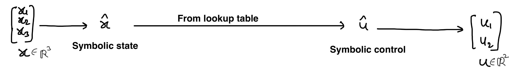
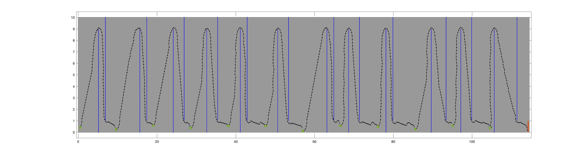
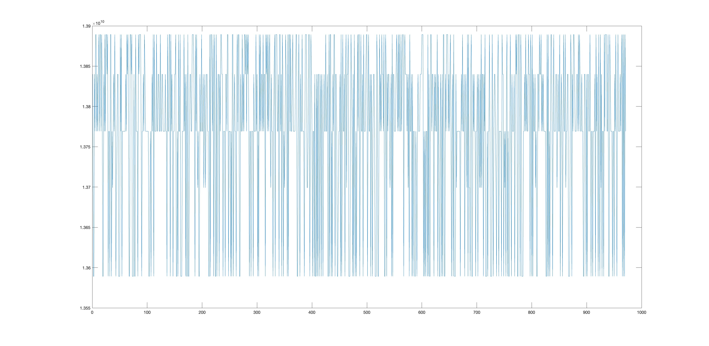

# Symbolic_Controller_Access_time_via_microarchitecture_Simulator
Time to access symbolic control input via [Scarab](https://github.com/kofyou/scarab) (a microarchitecture simulator)


Thanks to [Mingsheng Xu](https://kofyou.github.io) for [CMakeLists.txt](files/CMakeLists.txt) which is used to run start/stop API of DynamoRio.

## For a 3 dimensional kinematic vehicle model, symbolic controller for reachability computed using [SCOTSv0.2](https://github.com/mahendrasinghtomar/SCOTSv0.2_Copy):
* SCOTSv0.2 saves symbolic controller, in the form of a lookup table, in a '.scs' file. To get a controller of size greater than 1 GB, multiple adjacent scenarios with randomised location of obstacles is created. 
* Accessing control input from a symbolic controller:

The memory trace for the symbolic-control-input-access is obtained by (see lines 120 - 124 in [simulate4.cpp](files/simulate4.cpp)):
```
      dr_app_setup();
      dr_app_start();
      std::vector<input_type> u = conVec[i].get_control<state_type,input_type>(x);
      dr_app_stop_and_cleanup();
```
where `conVec[i]` is the symbolic-controller for the ith scenario.

<!-- * For a selected vehicle scenario composed of 12 scenes, each with a controller of size ~95 MB -->
* The below figure shows the arena:  with obstacles in color blue, the target area in red, and a trajectory in color black.
The controller is obtained by considering the arena to be composed of 12 adjacent scenes, each with a [controller](files/vehicle_controller_msa_0.scs) of size ~96 MB. 
The trajectory for initial state x0 = {.5, 0.4, 0} is [simulated](files/simulate4.cpp) and the target set is reached in 971 steps.
* Amazon [Deepracer](https://www.amazon.com/dp/B07JMHRKQG?th=1) involves Intel(R) Atom(TM) Processor E3930, which is based on the [Goldmont](https://en.wikichip.org/wiki/intel/microarchitectures/goldmont) microarchitecture. 
The parameter file for [KabyLake](https://github.com/kofyou/scarab/blob/master/src/PARAMS.kaby_lake) is edited to match the available data for Deepracer, and is named [PARAMS.GoldmontV01](files/PARAMS.GoldmontV01).
* During [trajectory simulation](files/simulate4.cpp), for each cycle of control access, a separate trace file generated. The EXECUTION_TIME of a trace in Scarab, with [PARAMS.GoldmontV01](files/PARAMS.GoldmontV01), is taken to be the access time of symbolic control. The plot of time over 971 steps is:  The time lies in the range **`13.58921718 to 13.88921688 microsecond`**.
* With [PARAMS.kaby_lake](https://github.com/kofyou/scarab/blob/master/src/PARAMS.kaby_lake) the access time of symbolic control is in the range **`7.61875 to 7.67875 microsecond`**.